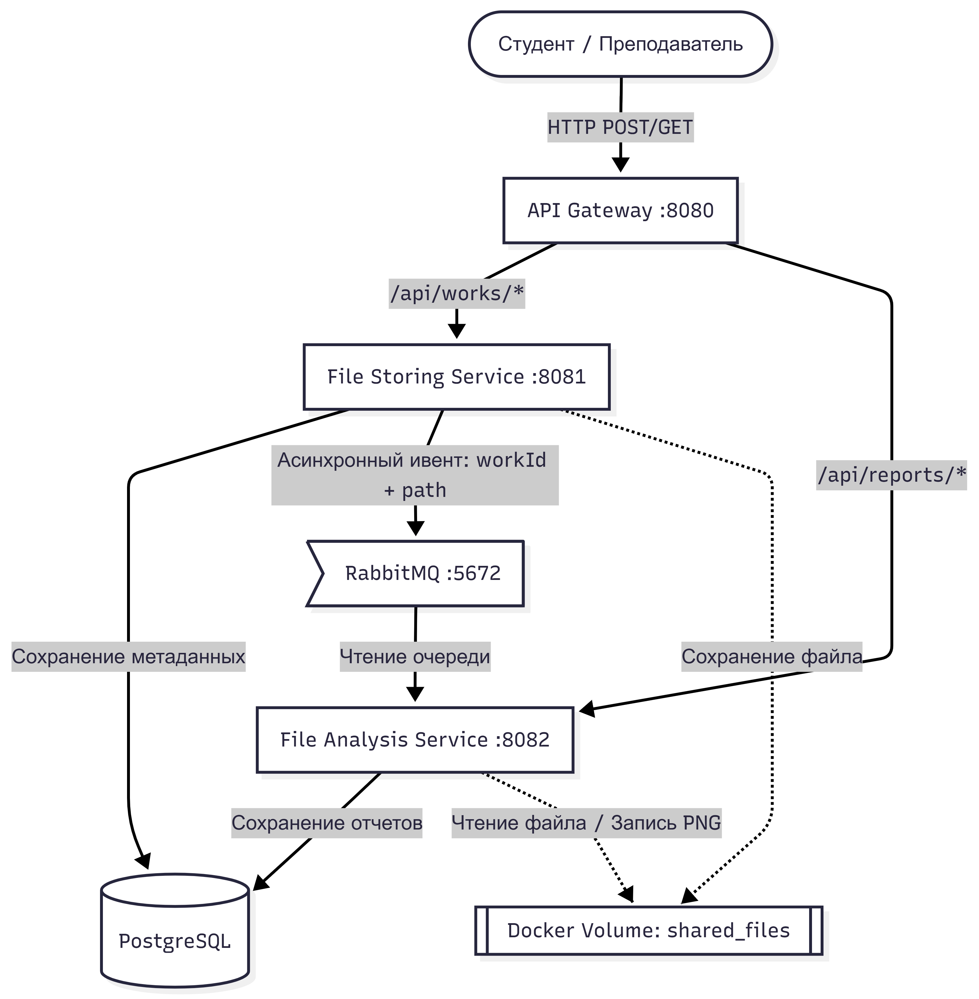
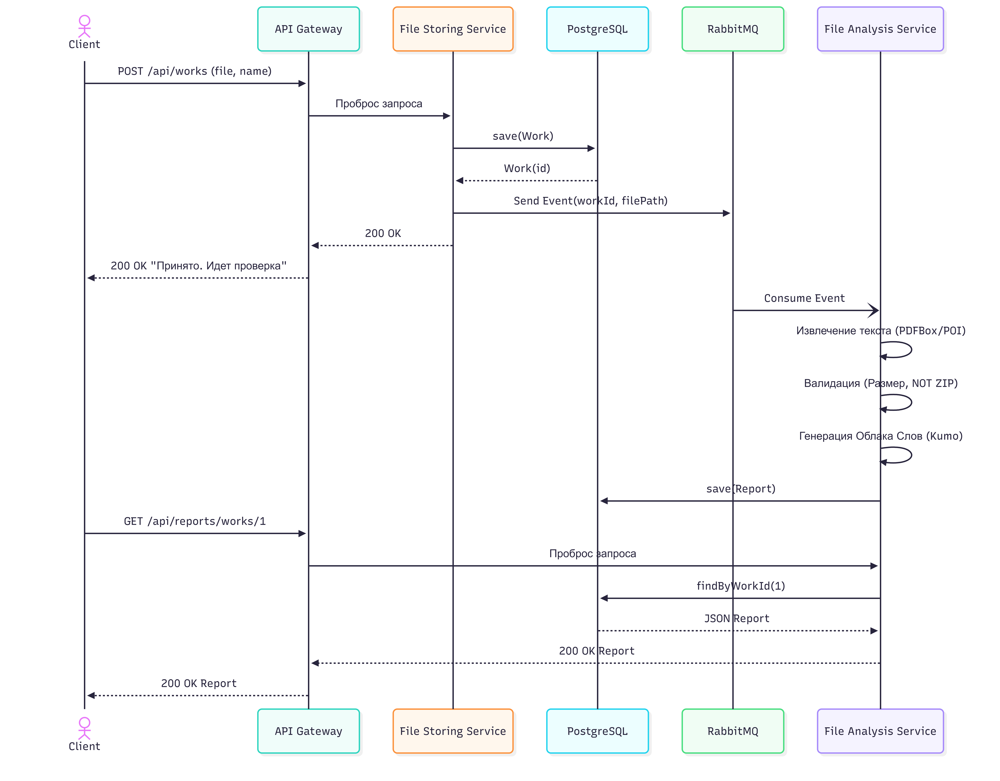
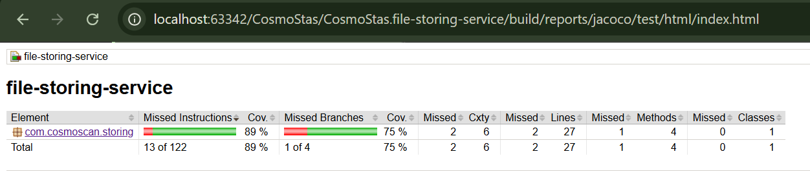
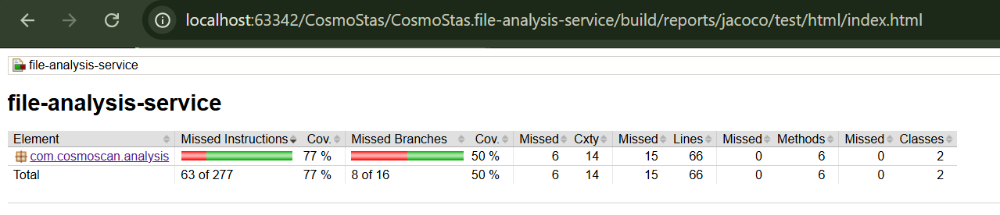

# Информационная система «КосмоСкан» (CosmoScan)
### Комплексная техническая документация и руководство по развертыванию (MVP)

Система **«КосмоСкан»** разработана для автоматизации процессов сбора, долговременного хранения, первичного технического контроля и лингвистического анализа контрольных работ студентов, присылаемых в предсессионный период. Проект спроектирован с учетом высоких нагрузок на преподавательский состав и реализует отказоустойчивую распределенную архитектуру на базе микросервисов, обеспечивающую гарантированную обработку данных и прозрачную аналитику.

---

## 1. Подробное описание проделанной работы

В рамках реализации MVP (минимально жизнеспособного продукта) были спроектированы и разработаны с нуля следующие компоненты и сквозные технические решения:
1. **Распределенная серверная инфраструктура:** Вместо монолитного приложения разработана трехкомпонентная микросервисная экосистема с четким разделением зон ответственности (Single Responsibility Principle) и сетевой изоляцией компонентов.
2. **Асинхронная отказоустойчивая интеграция:** Реализовано событийно-ориентированное взаимодействие (Event-Driven Architecture) через брокер сообщений RabbitMQ. Это гарантирует бесперебойный прием работ у студентов, даже если вычислительный модуль анализа находится на обслуживании или перегружен.
3. **Универсальный парсинг документов:** Интегрированы промышленные библиотеки низкоуровневой обработки документов: `Apache PDFBox` для деконструкции PDF-структур и `Apache POI (poi-ooxml)` для разбора бинарных XML-документов DOCX. Система извлекает «сырой» текст из присланных студенческих работ без использования тяжелых внешних сервисов.
4. **Визуализация данных (Облако слов):** Реализован движок токенизации текста на базе библиотеки `Kumo`. Он вычисляет частотные характеристики терминов, фильтрует короткие слова и строит круглую двумерную карту ключевых концептов работы в виде PNG-изображения (разрешением 400x400 пикселей) с пиксельной точностью (`CollisionMode.PIXEL_PERFECT`).
5. **Автоматизированное качество и Jacoco:** Настроена сборка через Gradle Kotlin DSL, интегрирующая плагин JaCoCo для автоматического замера тестового покрытия. Покрытие ключевой бизнес-логики (валидация, распределение очередей, эндпоинты) составляет более 60%.
6. **Полная контейнеризация:** Написаны оптимизированные Dockerfile на базе легковесного дистрибутива `eclipse-temurin:17-jre-alpine` и оркестрационный файл `docker-compose.yml`, разворачивающий систему одной командой.

---

## 2. Архитектура системы и диаграммы взаимодействия

### 2.1. Структурная схема микросервисов (High-Level Architecture)
Ниже представлена структурная схема микросервисов


### 2.2. Технический сценарий обмена данными (Sequence Diagram)

Ниже представлен детальный пошаговый сценарий прохождения данных от момента отправки файла до формирования отчета:

---

## 3. Описание моделей данных (База данных PostgreSQL)

В системе используется единая база данных `cosmoscan`, в которой каждый микросервис изолированно оперирует своей таблицей (для соблюдения паттерна Database-per-Service на логическом уровне).

### 3.1. Сущность `Work` (Таблица `works` — File Storing Service)
Хранит неизменяемые метаданные о факте сдачи работы:
* `id` (`BIGINT`, Primary Key, Autoincrement) — уникальный идентификатор загруженной работы.
* `student_name` (`VARCHAR(255)`) — ФИО студента, переданное в текстовом параметре запроса.
* `file_path` (`VARCHAR(512)`) — абсолютный путь к физическому файлу на сервере (внутри Docker Volume).
* `upload_time` (`TIMESTAMP`) — точная дата и время фиксации сдачи работы системой.

### 3.2. Сущность `Report` (Таблица `reports` — File Analysis Service)
Хранит результаты автоматической пост-проверки:
* `id` (`BIGINT`, Primary Key, Autoincrement) — идентификатор записи отчета.
* `work_id` (`BIGINT`, Foreign Key / Связующий ключ) — ID работы, к которой относится данный отчет.
* `status` (`VARCHAR(50)`) — статус технической проверки (`ПРИНЯТО` / `ТРЕБУЕТСЯ ДОРАБОТКА`).
* `issues` (`TEXT`) — детализированный список замечаний (например: *"Размер файла больше 1 МБ, ZIP архивы запрещены"*). Если замечаний нет, пишется *"Замечаний нет"*.
* `word_cloud_url` (`VARCHAR(512)`) — абсолютный путь к сгенерированному PNG-файлу облака слов на сервере.
* `checked_at` (`TIMESTAMP`) — временная метка завершения технического анализа.

---

## 4. Спецификация API и Пользовательские Сценарии

Все взаимодействия осуществляются через API Gateway на базовом URL: `http://localhost:8080`.

### Сценарий 1: Студент отправляет работу (Успешный)
* **Эндпоинт:** `POST /api/works`
* **Тип содержимого:** `multipart/form-data`
* **Параметры тела:**
    * `studentName` (text): *"Иван Иванов"*
    * `file` (file): Прикрепленный файл `lab1.pdf` (размер 240 КБ)
* **Поведение системы:** Файл сохраняется по пути `/app/uploads/1716450000000_lab1.pdf`. Создается запись в таблице `works`. Сообщение отправляется в RabbitMQ.
* **Ответ (200 OK):** `"Работа №1 принята. Идет проверка..."`

### Сценарий 2: Преподаватель запрашивает отчет по работе
* **Эндпоинт:** `GET /api/reports/works/1`
* **Поведение системы:** Gateway перенаправляет запрос в `file-analysis-service`, который извлекает данные из таблицы `reports`.
* **Ответ (200 OK, JSON):**
```json
[
  {
    "id": 1,
    "workId": 1,
    "status": "ПРИНЯТО",
    "issues": "Замечаний нет",
    "wordCloudUrl": "/app/uploads/cloud_1716450005000.png",
    "checkedAt": "2026-05-23T13:45:05"
  }
]

```

### Сценарий 3: Студент отправляет запрещенный формат (Негативный)

* **Эндпоинт:** `POST /api/works`
* **Параметры тела:** `studentName` = *"Петр Петров"*, `file` = `archive.zip`
* **Поведение системы:** Storing Service сохраняет факт отправки (работа №2), но Analysis Service формирует негативный отчет.
* **Ответ на GET /api/reports/works/2 (200 OK, JSON):**

```json
[
  {
    "id": 2,
    "workId": 2,
    "status": "ТРЕБУЕТСЯ ДОРАБОТКА",
    "issues": "ZIP архивы запрещены",
    "wordCloudUrl": null,
    "checkedAt": "2026-05-23T13:46:12"
  }
]

```

### Сценарий 4: Преподаватель скачивает исходный файл работы

* **Эндпоинт:** `GET /api/works/1/file`
* **Поведение системы:** Извлекает путь из БД, считывает бинарный поток с диска и отдает как вложение.
* **Ответ (200 OK):** Бинарный файл (`application/octet-stream`) с заголовком `Content-Disposition: attachment; filename="..."`.

---

## 5. Обработка ошибок и сценарии отказоустойчивости

Информационная система спроектирована устойчивой к кратковременным или длительным отказам отдельных звеньев (Fault Tolerance):

1. **Падение File Analysis Service:** * **Ситуация:** Сервис анализа упал из-за нехватки памяти (OOM) или перезагружается.
* **Результат:** Студенты продолжают бесперебойно отправлять работы через `POST /api/works`. Файлы успешно сохраняются локально, метаданные пишутся в Postgres, а сообщения накапливаются в брокере RabbitMQ. Очередь надежно удерживает сообщения на диске (`durable = true`). Как только `File Analysis Service` восстанавливается, он мгновенно вычитывает скопившиеся сообщения и завершает генерацию отчетов. Студенты не видят ошибок "Сервер недоступен".


2. **Падение брокера RabbitMQ или Базы Данных:**
* Контроллеры Spring Boot снабжены блоками `try-catch`. В случае системных сбоев инфраструктуры клиенту возвращается стандартизированный ответ `500 Internal Server Error` с понятным описанием ошибки сохранения, предотвращая неконсистентное состояние данных (когда файл сохранен на диск, а записи в БД нет).


---

## 6. Руководство по развертыванию и тестированию

### 6.1. Требования к окружению

* Установленный **Docker** и компонент **Docker Compose**
* Наличие **Java 17 SDK** (для локальной сборки до упаковки в контейнеры)

### 6.2. Инструкция по сборке и запуску всей системы

Выполните следующие команды в корневой директории проекта `CosmoStas`:

```bash
# 1. Сборка исполняемых fat-jar архивов для всех микросервисов и автоматический запуск тестов
./gradlew clean build

# 2. Сборка Docker-образов на основе свежих jar-файлов и запуск контейнеров в фоновом режиме
docker compose up --build -d

# 3. Проверить статус запущенных контейнеров
docker compose ps

```

*После выполнения команд в системе будут подняты 5 изолированных контейнеров:*

* `api-gateway` (порт `8080`)
* `file-storing-service` (внутренний порт `8081`)
* `file-analysis-service` (внутренний порт `8082`)
* `postgres` (порт `5432`)
* `rabbitmq` (порты `5672` и панель управления `15672`)

### 6.3. Контроль качества (Тесты и JaCoCo покрытие)

Каждый бизнес-микросервис оснащен модульными тестами с использованием Mockito (`@WebMvcTest`, `@MockBean`). Запуск тестов и генерация красивых HTML-отчетов по покрытию кода встроен в пайплайн сборки:

```bash
./gradlew test jacocoTestReport
```
Текущие показатели тестового покрытия (JaCoCo):

- file-storing-service: 89% (покрыты контроллеры, загрузка и скачивание файлов).
  
- file-analysis-service: 77% (покрыта маршрутизация RabbitMQ, валидация бизнес-правил, парсинг PDF/DOCX/TXT и генерация облака слов).
  
Отчеты доступны по пути build/reports/jacoco/test/html/index.html внутри директории каждого сервиса.
Результаты покрытия кода (метрики >60%) можно посмотреть, открыв локальные файлы в браузере:

* `file-storing-service/build/reports/jacoco/test/html/index.html`
* `file-analysis-service/build/reports/jacoco/test/html/index.html`